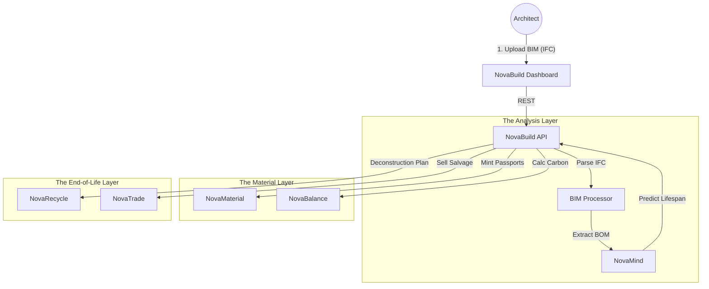

# 🏗️ NovaBuild

> **The Operating System for Circular Construction.**
> Digital management of the built environment, Buildings as Material Banks (BAMB), and deconstruction planning.

[](https://www.google.com/search?q=https://github.com/novaeco-tech/novabuild/actions)
[](https://opensource.org/licenses/MIT)
[](https://www.google.com/search?q=https://build.novaeco.tech)

**NovaBuild** is the Vertical Sector responsible for the **Construction** industry. While `NovaMake` manufactures movable objects, **NovaBuild** manages immobile assets—skyscrapers, bridges, and roads.

It integrates with **Building Information Modeling (BIM)** software to track every beam, window, and screw from design to deconstruction. It acts as the compliance engine for the **EU Energy Performance of Buildings Directive (EPBD)** and the **Digital Building Logbook**.

-----

## 🎯 Value Proposition

Construction consumes 50% of all extracted materials. **NovaBuild** shifts the industry from "Demolition" (waste) to "Deconstruction" (recovery):

1.  **Material Banking:** Treating a building as a temporary storage depot for valuable high-grade steel and concrete.
2.  **Embodied Carbon Tracking:** Calculating the CO₂ cost of *building* the structure (Scope 3), not just the energy used to run it.
3.  **Adaptive Reuse:** Facilitating the "renovation wave" by providing accurate data on existing structural capacity, reducing the need for new concrete.

-----

## 🏗️ Architecture (The BIM Loop)

NovaBuild is data-heavy. It ingests massive 3D models (IFC files) and links specific elements (e.g., "Column C4") to the NovaEco ecosystem.



### Integrated Services

  * **[NovaMaterial](https://www.google.com/search?q=https://materials.novaeco.tech):** The ledger. NovaBuild generates a Passport for "Steel Beam ID-99" at the moment of installation. 50 years later, that Passport proves the steel's grade for reuse.
  * **[NovaBalance](https://www.google.com/search?q=https://balance.novaeco.tech):** The auditor. It calculates the **Embodied Carbon** of the structure, allowing developers to trade "Low Carbon" credits on `NovaTrade`.
  * **[NovaRecycle](https://www.google.com/search?q=https://recycling.novaeco.tech):** The destination. When a building is retired, NovaBuild sends a "Demolition Manifest" to NovaRecycle, predicting exactly how tons of concrete will arrive.
  * **[NovaMind](https://www.google.com/search?q=https://mind.novaeco.tech):** The structural engineer. Uses AI to analyze BIM models and suggest "Design for Disassembly" improvements (e.g., "Use bolts instead of glue").

-----

## ✨ Key Features

### 1\. The Digital Building Logbook

A "Medical Record" for the building.

  * **History:** Tracks all renovations, permit approvals (`NovaPolicy`), and maintenance events.
  * **Compliance:** Auto-generates reports for EU Taxonomy alignment.

### 2\. BIM-to-Passport Bridge

Automated ingestion of Industry Foundation Classes (IFC).

  * **Process:** Upload a Revit/Archicad model.
  * **Action:** NovaBuild iterates through every object in the 3D model. If it sees a "Window," it creates a `NovaMaterial` asset entry linked to that specific 3D coordinate.

### 3\. Deconstruction Planner

The "Reverse Lego" manual.

  * Instead of a wrecking ball, NovaBuild generates a step-by-step guide to dismantling the building.
  * **Valuation:** Estimates the salvage value of the components on `NovaTrade` before the building is even touched.

### 4\. Smart Demolition Yields

Integration with `product-urban-miner`.

  * Reports aggregated data to the city council: "In 2027, the 'Plaza Tower' demolition will release 500 tons of Aluminum into the local supply chain."

-----

## 🚀 Getting Started

We use **DevContainers** to provide a consistent development environment.

### Prerequisites

  * Docker Desktop
  * VS Code (with Remote Containers extension)
  * **Recommended:** A BIM viewer (like Solibri or Autodesk Viewer) for verifying IFC exports.

### Installation

1.  **Clone the repo:**
    ```bash
    git clone https://github.com/novaeco-tech/novabuild.git
    cd novabuild
    ```
2.  **Open in VS Code:**
      * Run `code .`
      * Click **"Reopen in Container"** when prompted.
3.  **Start the Sector:**
    ```bash
    make dev
    ```
      * **Dashboard:** http://localhost:3000 (Includes 3D IFC.js Viewer)
      * **API:** http://localhost:8000/docs

### Configuration (`.env`)

```ini
# BIM Settings
IFC_PARSER_ENGINE=IFCOPENSHELL
DEFAULT_LIFESPAN_YEARS=50

# Integrations
NOVAMATERIAL_URL=http://novamaterial-api:8000
NOVABALANCE_URL=http://novabalance-api:8000
```

-----

## 📂 Repository Structure

This is a Monorepo containing the sector's specific logic.

```text
novabuild/
├── api/                # Python/FastAPI (Domain Logic)
│   ├── src/
│   │   ├── bim/        # IfcOpenShell wrappers for parsing 3D models
│   │   ├── passport/   # Logic to map BIM objects to NovaMaterial
│   │   └── audit/      # Embodied carbon calculators
├── app/                # React/Next.js Frontend (Architect Dashboard)
│   ├── src/
│   │   ├── viewer/     # IFC.js / Three.js 3D viewer components
│   │   └── logbook/    # Timeline UI for building events
├── website/            # Documentation (Docusaurus)
└── tests/              # Integration tests
```

-----

## 🧪 Testing

We use **Model Simulation** for testing.

  * **IFC Parse Test:** `make test-bim`
      * Loads a sample `house.ifc` file. Verifies that the API correctly identifies 4 walls, 1 roof, and 2 doors.
  * **Lifecycle Test:** `make test-cycle`
      * Simulates a 50-year timeline. Verifies that the "Residual Value" of the steel beams depreciates correctly according to the material model.

-----

## 🤝 Contributing

We need contributors with backgrounds in **Civil Engineering**, **Architecture (BIM)**, and **3D Graphics (WebGL/Three.js)**.
See [CONTRIBUTING.md](https://www.google.com/search?q=../.github/CONTRIBUTING.md) for details.

**Maintainers:** `@novaeco-tech/maintainers-sector-novabuild`